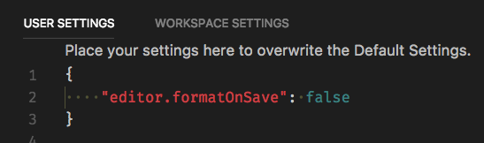
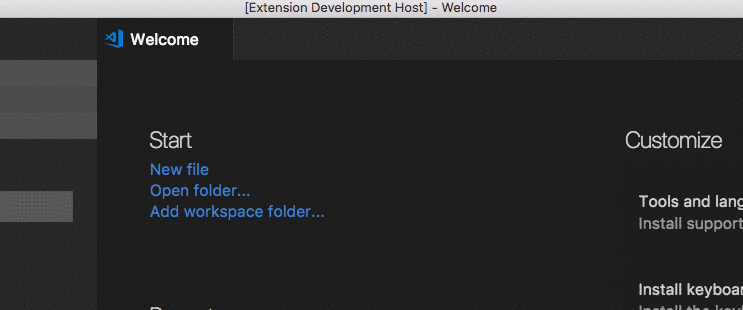
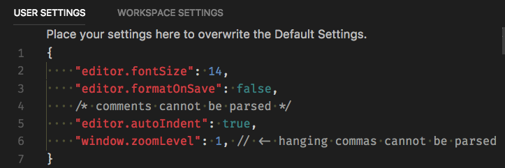

# Toggle Format on Save

Provides a command to toggle Format on Save (`editor.formatOnSave`) inside VS Code.

Open your Command Palette (`CMD`/`CTRL`+`SHIFT`+`P`) and type `Toggle Format on Save`, then hit `Enter`.

**Important**: Backup your `settings.json` file (`CMD`/`CTRL`+`,`), . Since there currently isn't a VS Code API for editing setting-files, it is done manually with `JSON.parse`. This means the extension will parse the whole file, toggle `editor.formatOnSave`, and save the settings file.

**Important**: You will get a warning if your `settings.json` is not valid JSON. VS Code allows this file to contain invalid syntax like comments, and hanging commas (the last field in an object should not have a comma after it). If you fix these issues manually, then the Toggle command should work fine.

### Thanks

The `settings.json` parsing code has been inspired by [vscode-softwrap](https://github.com/jsturtevant/vscode-softwrap) & [vscode-togglecodelens](https://github.com/cmlewis89/vscode-togglecodelens)
